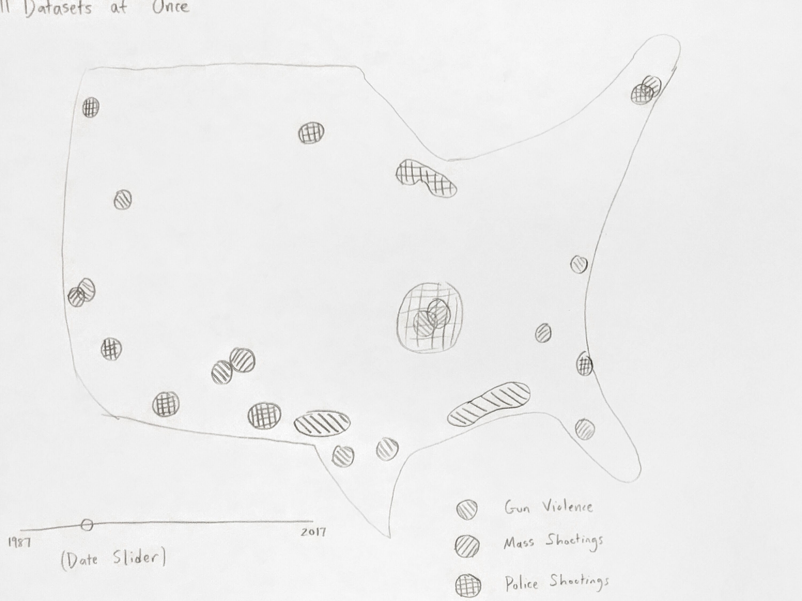
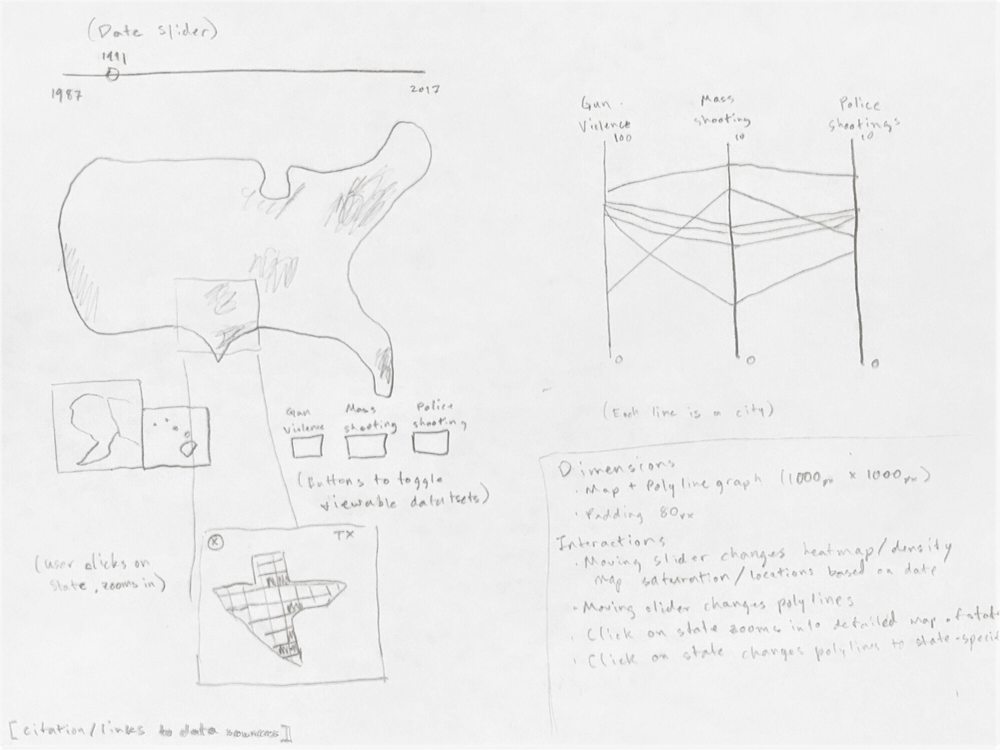
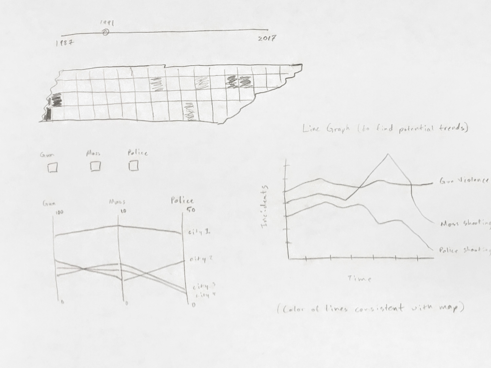

# Gun Violence
Team: Able Shi and Roger Li
## Project Topic
Our project seeks to find any trends related to mass shootings, police shootings, and gun violence in the United States. If trends exist, then we want to analyze the relationships and how they trend across the entire country.

## Background and Motivation
It seems like mass shootings and police brutality are increasingly occurring on media outlets. We would like to determine whether this is truly due to increased gun violence, or increased media coverage. Either way, we would also like to examine the relationships of police shootings, mass shootings, and gun violence between each other and also over time.

## Objectives
We want to examine different gun violence trends over time and across the United States. We want to create a UI that'll be user-friendly and effective. We hope to be able to see some surprising relationships or even surprising non-relationships.

## Data
We are aggregating three different data sources - [mass shootings](https://www.kaggle.com/jlmontie/stanford-msa-2017/home), [fatal police shootings](https://www.kaggle.com/kwullum/fatal-police-shootings-in-the-us), and [general gun violence](https://www.kaggle.com/jameslko/gun-violence-data). These datasets were gathered through public datasets.

## Data Processing
We will display the data on a Choropleth map using map data (.shp) from the [US Census](https://www.census.gov/geo/maps-data/data/tiger-cart-boundary.html) that has been converted to JSON for use in our project.

Since we are aggregating data from three different sources, some data processing will need to be completed in order to ensure our visualization displays consistent data (e.g. consistent location data elements). Data is already organized in `.csv` files so we suspect  filtering out the data elements of interest from all three sources will be a fairly straightforward process.

Furthermore, we would like to explore the possibility of extrapolating data from our original sources. In particular, we would like to derive density as an estimation. This could add some nice features such as clustering which we will mention further in the next section.

Overall, we hope to complete data processing well within a week.

## Must-Have Features
The first feature we hope to implement will be individual datasets mapped over time. We will have three layers of data that the user can toggle and a slider to indicate time. The user can adjust the dataset and slider to see the instantaneous and continuous change in data over time across the United States.

The second feature would be zoom-in features. The user should be able to click on a state and this will zoom into the desired state. The state will be more detailed with county lines. Big cities will be marked on the map.

The third feature will be a parallel coordinates graph under the map with data from the current time from all three datasets. If the map view is the entire United States, then the data for the parallel coordinates will be from the entire US. If the user is zoomed into the state, then the parallel coordinates graph will only feature data from the state. In addition, the user can also click on major cities, and this city's data will be reflected in the PC graph.

## Optional Features
Currently, our design plan forces the user to continuously use the time slider in order to see trends over time. We think that adding a third graph somewhere that shows the entire timeline would be beneficial. This could be a line graph that graphs each dataset as a line and has the x-axis as time. This way, the user can see the overall changes that occur over time at once.

Another feature we would like to add is the ability to preview a state before clicking on it. Say the user hovers over the state of Tennessee, then there should be a preview window that pops up that shows a smaller version of what they would see before clicking. In this case, the pop-up would be Tennessee. Upon click, the hover would disappear and the screen would transition into the state.

## Project Schedule
Deadline:
* November 14: Data processing
* November 21: Implementation of map of US with data populated, toggle added, and slider enabled
* November 28: Implementation of zoom-ins and individual states, and parallel coordinates
* December 7: Clean up and add optional features

## Visualization Design
US Overivew:

US Multiview:

US Stateview:

## Instructions
Clone this repo by running `git clone https://github.com/lirg/pewpewclackclack` command

Ensure python2.7 or python3 is installed

If you are running python2.x, then issue: `python -m SimpleHTTPServer to the terminal`. If you are running python3.x, then issue: `python -m http.server` in order to start a local server

Now using Google Chrome or Firefox go to <localhost:8000/data_vis_project/index.html> in order to view the project visualization.

